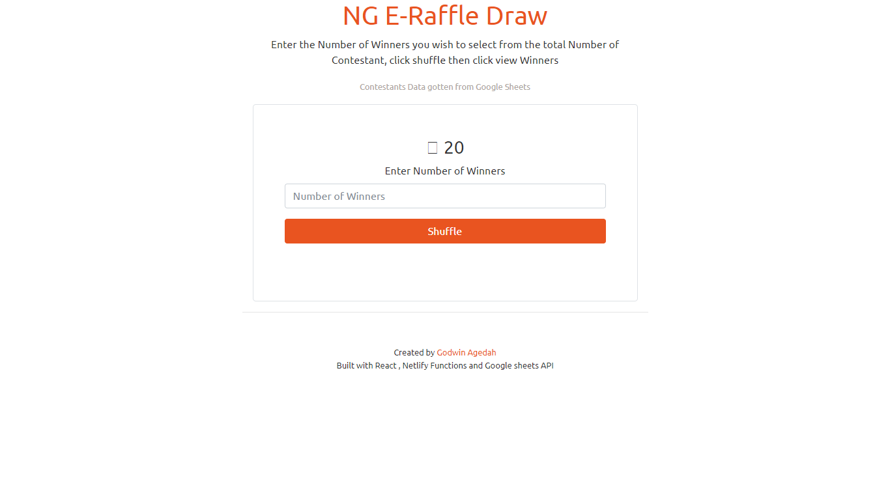
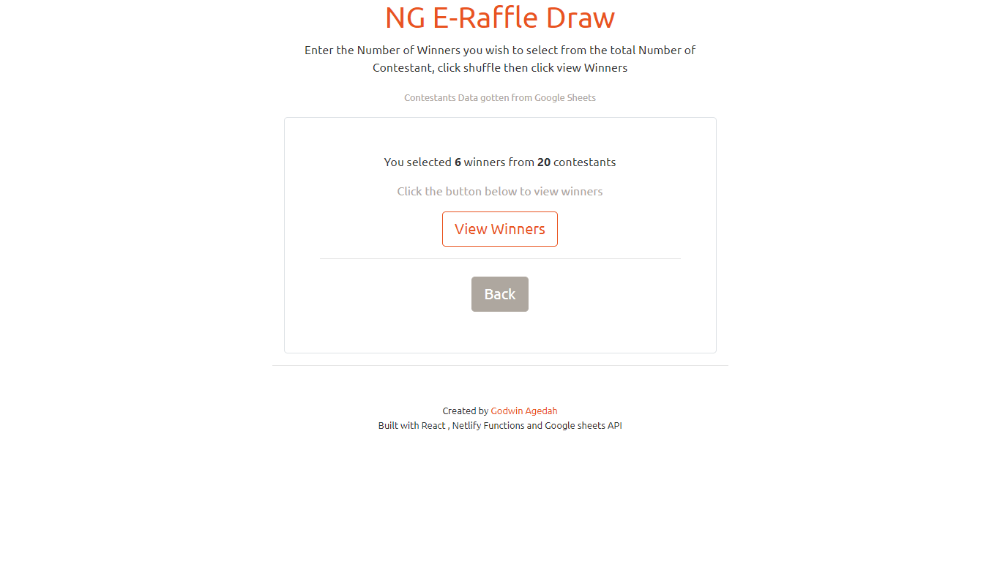
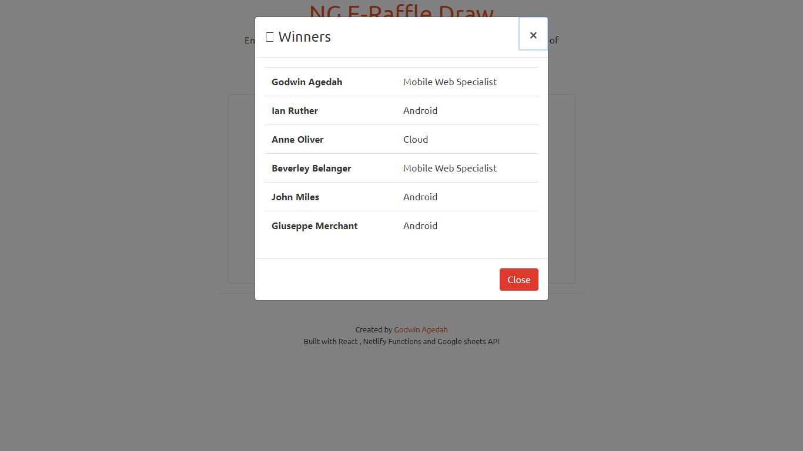

# NgElectronicRaffleDraw

Using a Mock HTTP call to a get collection of contestansts the system selects a number of numbers as specified from the interface.

## What I learnt/Did

* Consumed an API using Angular HTTP client.
* Generate a random collection of data from the total.
* Used Angular Directives to hide and show UI Elements.
* NG bootstrap was used for the modal.

## Screenshots

## Side Fact

* Built the same Project with React using Data from Google sheets using the Google sheets API.
